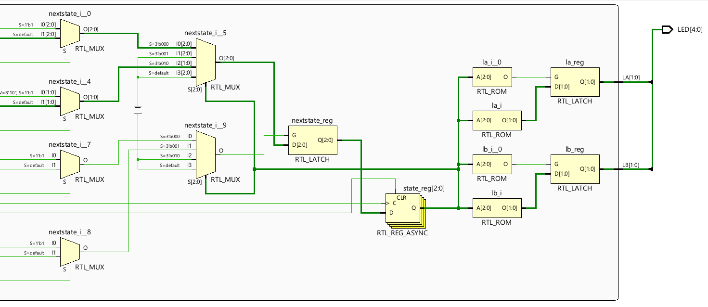
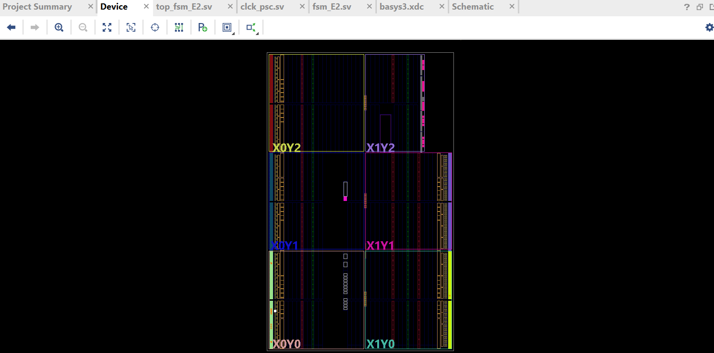

# Maquina de estados finitos
 Maquina de estados implementada con un semaforo
# Serie I y serie II
## Serie I
En este documento se presenta el parcial No. 2 que consiste en una maquina de estados finitos implementada con dos semaforos y ademas un detector de peatones.

Los estados que se utilizan se pueden observar en la siguiente imagen:

    

El detector de peatones tiene como funcion dar prioridad a los peatones que esten por cruzar las calles. El peaton que cruza sobre la avenida tiene mas prioridad que el peaton que viene sobre la calle porque se supone que transitan mas personas sobre la avenida.
Entonces, cuando se detecte un peaton sobre la avenida (PeatonA), si el semaforo de la avenida esta en verde(S0), comienza el cambio de estado para el siguiente(S1) y cuando se mantiene de esta manera pasa al siguiente estado(S2), de esta manera el semaforo de la avenida se pondra en rojo y los peatones podran pasar. De lo contrario el semaforo se guiara por los vehiculos que esten pasando sin tomar en cuenta los peatones.

La tabla generada con las entradas, salidas y estados actual y siguiente fue la siguiente:

# VIVADO
Para la programacion en SystemVerilog se utilizaron tres fuentes:
- TOP de la maquina de estados finitos que es donde se enlaza y se llama a las condicientes del clock y los switches que se estaran utilizando.

- Clock es donde se declara la variable del reloj y se declara las variables logicas de entrada y salida.

- El modulo E2 es donde se crean los casos con condicionales para idicar como se comportaran los leds del semaforo, dependiendo de las condiciones de entrada.

- Basys3 es donde indicamos y habilitamos los switches y leds que funcionaran el la Basys.

## Serie II
### RTL Analisys
Verificamos y analizamos el diseño del hardware con los registros y estados que estemos utilizando. Podemos obserbar la transferencia de registros y el proceso dentro del circuito digital.
En esta parte podemos obtener el esquematico por medio de nuestra programacion.

### Sintesis

La sintesis se encarga de convertir el diseño que describimos con el codigo de programacion en una forma que puede ser utilizada por un chip, en este caso el FPGA (Basys3). Cuando finaliza la sintesis, el diseño se puede poner en el chip utilizando las herramientas para que pueda enrrutar de la manera correcta las conexiones dentro del chip.

### Implementacion

 la implementación convierte el diseño lógico abstracto en un diseño físico específico que puede ser cargado en un FPGA para su funcionamiento real.

 

 ### Program and Debug

 Es el proceso final en el flujo de diseño de hardware digital, donde se carga y verifica el diseño implementado en un FPGA para su funcionamiento real.

 ### Discusion de resultados

Una máquina de estados finitos (FSM) para controlar un semáforo podría tener estados como "verde", "amarillo" y "rojo", con transiciones entre estos estados determinadas por el tiempo y sensores simulados para el paso de vehiculos asi como el paso de peatones.
La funcionalidad, se analiza si la FSM cumple con los requisitos operativos del semáforo, es decir que cambia a los estados deseados, tiempos de espera en cada estado y las transiciones suaves entre estados para evitar situaciones peligrosas.

### Video
https://drive.google.com/file/d/1EliVfW5OCX0SdGWGq9c8r_TqgGhmLIuj/view?usp=sharing
https://drive.google.com/file/d/1kBIkNQNR9jFUfUQjdzfoYG7ClnFwkz3H/view?usp=sharing